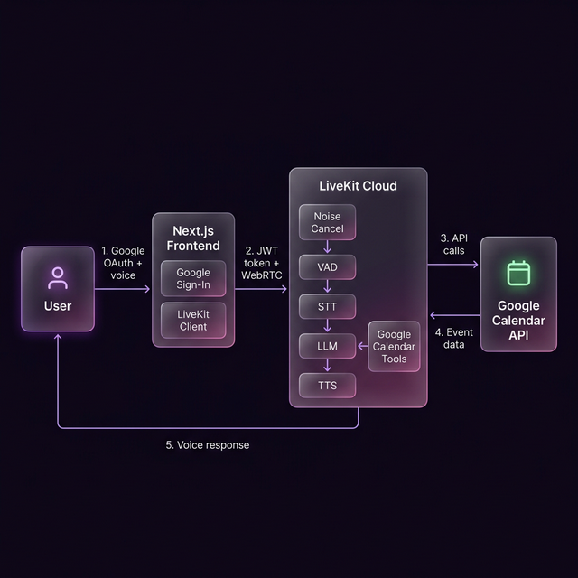

# Calendar Voice Agent

A voice-powered AI assistant for Google Calendar. Sign in with Google, hit a button, and just talk — schedule meetings, check your day, or delete events, all hands-free.

Built with [LiveKit Agents](https://docs.livekit.io/agents/) (Python backend) and [Next.js](https://nextjs.org/) (frontend).

---

## How it works

1. User signs in with Google (frontend requests calendar access)
2. Frontend connects to a LiveKit room and sends the Google access token to the agent via a data channel
3. The Python agent picks up the token, builds a Google Calendar service, and starts a voice session
4. User speaks — the agent listens, thinks, and responds using speech, reading and writing to Google Calendar

```
Browser  →  Next.js frontend  →  LiveKit Cloud  →  Python agent  →  Google Calendar API
```

---

## Architecture



### Architecture details

**1. Client & Connection**
- User signs in with Google; browser gets an OAuth token scoped to `calendar`.
- Frontend calls `/api/livekit` → generates a LiveKit JWT and dispatches the agent.
- Browser joins the room via WebRTC; LiveKit Cloud assigns the job to the Python agent.
- Frontend sends the Google token to the agent over a LiveKit data channel.

**2. Hearing & Processing**
- Mic audio flows through LiveKit SFU into the Python agent.
- **Noise Cancellation (BVC)** cleans the audio stream.
- **VAD (Silero)** detects when the user is speaking.
- **Turn Detection (MultilingualModel)** detects when the user has finished speaking.
- **Speech-to-Text (AssemblyAI / Deepgram)** transcribes the speech into text.

**3. Thinking & Intent**
- **LLM (GPT-4o-mini / Gemini)** analyzes the transcript to determine user intent.
- If a calendar action is required, the LLM tells `calendar_tools.py` what to do.
- `calendar_tools.py` uses the OAuth token to read/write to the Google Calendar API and returns the result to the LLM.

**4. Speaking**
- The LLM streams its text response to the **Text-to-Speech engine (ElevenLabs)**.
- The synthesized audio is sent back through LiveKit Cloud to the user's browser in real-time.


## Project structure

```
Calendar Voice Agent/
├── frontend/              # Next.js app (UI + LiveKit token API)
│   └── src/app/
│       ├── page.tsx       # Main UI
│       ├── layout.tsx
│       ├── globals.css
│       └── api/livekit/
│           └── route.ts   # Generates LiveKit token + dispatches agent
│
└── calendar-assistant/    # Python LiveKit agent
    ├── agent.py           # Agent entrypoint
    ├── calendar_tools.py  # Google Calendar tool functions
    ├── requirements.txt
    └── pyproject.toml
```

---

## Prerequisites

- **Node.js** v18 or later
- **Python** 3.10 or later
- A **LiveKit Cloud** account — [create one free at livekit.io](https://livekit.io)
- A **Google Cloud** project with the **Google Calendar API** enabled and an OAuth 2.0 **Web Application** credential

---

## 1. Google Cloud setup

1. Go to [console.cloud.google.com](https://console.cloud.google.com)
2. Create a new project (or use an existing one)
3. Enable the **Google Calendar API**: APIs & Services → Enable APIs → search "Google Calendar API"
4. Create OAuth credentials: APIs & Services → Credentials → Create Credentials → OAuth 2.0 Client ID
   - Application type: **Web application**
   - Authorized JavaScript origins: `http://localhost:3000` (add your production domain later)
   - Authorized redirect URIs: `http://localhost:3000` (add your production domain later)
5. Copy the **Client ID** — you'll need it for the frontend `.env.local`

---

## 2. LiveKit Cloud setup

1. Sign in at [cloud.livekit.io](https://cloud.livekit.io)
2. Create a project. From the project dashboard, copy:
   - **WebSocket URL** (looks like `wss://your-project-xyz.livekit.cloud`)
   - **API Key**
   - **API Secret**
3. Deploy your Python agent to LiveKit Cloud (see step 5 below). After deploying, find the **Agent ID** in the LiveKit Cloud dashboard — it looks like `CA_xxxxxxxxx`. You'll need this for the frontend.

---

## 3. Frontend setup

```bash
cd frontend
npm install
```

Create a file called `.env.local` inside the `frontend/` folder:

```env
# Your Google OAuth 2.0 Client ID
NEXT_PUBLIC_GOOGLE_CLIENT_ID=your-google-client-id-here.apps.googleusercontent.com

# LiveKit Cloud WebSocket URL
NEXT_PUBLIC_LIVEKIT_URL=wss://your-project-xyz.livekit.cloud

# LiveKit API credentials (used server-side only — never exposed to the browser)
LIVEKIT_API_KEY=your-livekit-api-key
LIVEKIT_API_SECRET=your-livekit-api-secret
```

Open `src/app/api/livekit/route.ts` and update the **Agent ID** on line 32 to match yours:

```ts
await agentDispatch.createDispatch(room, 'CA_YOUR_AGENT_ID_HERE');
```

Start the dev server:

```bash
npm run dev
```

The app will be available at [http://localhost:3000](http://localhost:3000).

---

## 4. Python agent setup

```bash
cd calendar-assistant

# Create and activate a virtual environment
python -m venv .venv

# On Windows:
.venv\Scripts\Activate.ps1

# On macOS/Linux:
source .venv/bin/activate

# Install dependencies
pip install -r requirements.txt
```

Create a file called `.env` inside the `calendar-assistant/` folder:

```env
LIVEKIT_URL=wss://your-project-xyz.livekit.cloud
LIVEKIT_API_KEY=your-livekit-api-key
LIVEKIT_API_SECRET=your-livekit-api-secret
```

---

## 5. Running locally

Open two terminals:

**Terminal 1 — Python agent:**

```bash
cd calendar-assistant

# Activate the virtual environment
.venv\Scripts\Activate.ps1   # Windows
source .venv/bin/activate    # macOS / Linux

# Install dependencies
pip install -r requirements.txt

# Download model files (only needed once)
python agent.py download-files

# Start the agent
python agent.py start
```

You should see:
```
registered worker  url=wss://your-project.livekit.cloud
```

**Terminal 2 — Next.js frontend:**

```bash
cd frontend
npm run dev
```

Open [http://localhost:3000](http://localhost:3000) in your browser.

---

## 6. Using the app

1. Click **Sign in with Google** and authorize calendar access
2. Click **Start voice session** — this connects to the LiveKit room and dispatches the agent
3. Wait for the agent to say hello, then speak naturally:
   - *"What's on my calendar this week?"*
   - *"Schedule a dentist appointment tomorrow at 2pm"*
   - *"Cancel my 3pm meeting on Friday"*


## Environment variable reference

### `frontend/.env.local`

| Variable | Description |
|---|---|
| `NEXT_PUBLIC_GOOGLE_CLIENT_ID` | Google OAuth 2.0 Client ID |
| `NEXT_PUBLIC_LIVEKIT_URL` | LiveKit Cloud WebSocket URL (`wss://...`) |
| `LIVEKIT_API_KEY` | LiveKit API key (server-side only) |
| `LIVEKIT_API_SECRET` | LiveKit API secret (server-side only) |

### `calendar-assistant/.env`

| Variable | Description |
|---|---|
| `LIVEKIT_URL` | LiveKit Cloud WebSocket URL (`wss://...`) |
| `LIVEKIT_API_KEY` | LiveKit API key |
| `LIVEKIT_API_SECRET` | LiveKit API secret |

---

## Tech stack

| Layer | Technology |
|---|---|
| Frontend | Next.js 15, React, TypeScript |
| Voice UI | LiveKit Components React, LiveKit Client |
| Auth | Google OAuth 2.0 via `@react-oauth/google` |
| Agent runtime | LiveKit Agents (Python) |
| STT | AssemblyAI (primary), Deepgram Nova-3 (fallback) |
| LLM | GPT-4o-mini (primary), Gemini 2.5 Flash (fallback) |
| TTS | ElevenLabs Turbo v2.5 |
| VAD | Silero |
| Calendar | Google Calendar API v3 |
